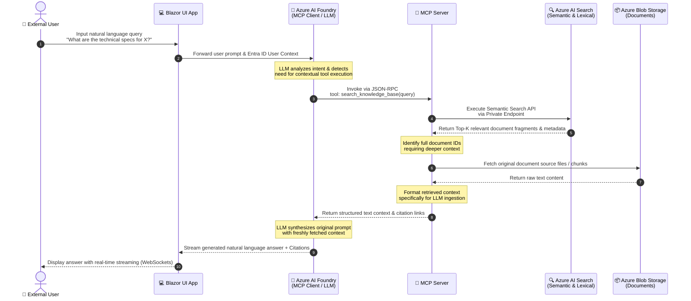

```mermaid
sequenceDiagram
    autonumber
    actor User as 👤 External User
    participant UI as 💻 Blazor UI App
    participant Client as 🤖 Azure AI Foundry<br>(MCP Client / LLM)
    participant Server1 as 🔌 MCP Server #1<br>(AI Search Tool)
    participant AISearch as 🔍 Azure AI Search<br>(Semantic & Lexical)
    participant Blob as 📦 Azure Blob Storage<br>(Documents)

    User->>UI: Input natural language query<br>"What are the technical specs for X?"
    UI->>Client: Forward user prompt & Entra ID User Context
    Note over Client: LLM analyzes intent & detects<br>need for contextual tool execution
    Client->>Server1: Invoke via JSON-RPC<br>tool: search_knowledge_base(query)
    Server1->>AISearch: Execute Semantic Search API <br>via Private Endpoint
    AISearch-->>Server1: Return Top-K relevant document fragments & metadata
    
    Note over Server1: Identify full document IDs<br>requiring deeper context
    Server1->>Blob: Fetch original document source files / chunks
    Blob-->>Server1: Return raw text content
    
    Note over Server1: Format retrieved context <br>specifically for LLM ingestion
    Server1-->>Client: Return structured text context & citation links
    
    Note over Client: LLM synthesizes original prompt<br>with freshly fetched context
    Client-->>UI: Stream generated natural language answer + Citations
    UI-->>User: Display answer with real-time streaming (WebSockets)
```
